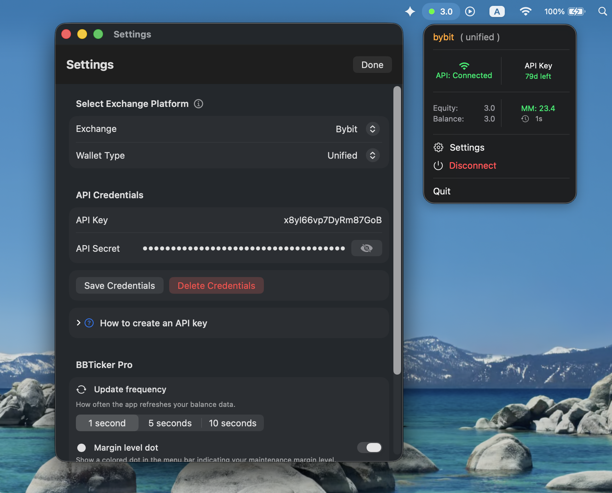

# BBTicker

**Crypto portfolio tracking for macOS and iOS.**

BBTicker puts your exchange equity directly in the macOS menu bar and provides an iOS companion with WidgetKit and Siri support.

Built as a personal project to explore modern Swift architecture, concurrency, modularization, and resilient API integrations.

<p align="center">
  
</p>

## Features

* Real-time exchange balance and equity tracking
* Native macOS menu bar experience
* iOS companion + WidgetKit
* Siri balance queries
* Read-only exchange API access
* Keychain credential storage
* Automatic reconnection with exponential backoff
* Production, testnet, and demo environments
* Extensible exchange integrations
* Swift concurrency and `@Observable`
* Unit and UI tests

**Currently supported:** Bybit (Unified Account)

## Architecture

The project is split into independent layers so exchange-specific code can evolve without coupling the application to a particular API.

```text
                    BBTicker
                 macOS / iOS / Widget
                         │
                       LLCore
                         │
                   LLApiService
                         │
              ┌──────────┼──────────┐
              │          │          │
           Bybit      Binance     ...
```

### LLCore

`LLCore` contains the stable domain layer and exchange abstractions.

Exchange implementations are resolved through a protocol-driven registry, keeping the core independent from concrete exchange implementations.

Adding an exchange should require implementing its API integration rather than modifying the application's business logic.

→ [LLCore](https://github.com/beemol/LLCore)

### LLApiService

`LLApiService` contains HTTP, authentication, request construction, response decoding, and exchange-specific API handling.

→ [LLApiService](https://github.com/beemol/LLApiService)

### State management

The application uses unidirectional data flow:

```text
Action
  ↓
Store
  ↓
Async Effect
  ↓
State
  ↓
@Observable
  ↓
SwiftUI
```

Services that own mutable state or cross-task resources use Swift actors.

## Why this architecture?

Exchange APIs are the most volatile part of the system. The goal is to keep that volatility isolated behind stable contracts while allowing new exchanges to be introduced without changing the application layer.

The project deliberately explores a level of modularity and extensibility beyond what is strictly necessary for a small crypto tracker.

## Security

* API credentials are stored in the macOS Keychain
* Exchange access is read-only
* Credentials are sent directly to the configured exchange over HTTPS
* No backend is required for portfolio data
* Analytics are opt-in

## Building

```bash
git clone https://github.com/beemol/bbticker.git
cd bbticker
open bbticker.xcodeproj
```

Open the `bbticker` scheme, select **My Mac**, and run.

Dependencies are managed with Swift Package Manager.

## Project structure

| Component      | Responsibility                                 |
| -------------- | ---------------------------------------------- |
| `BBTicker`     | macOS/iOS application and UI                   |
| `LLCore`       | Domain models, protocols, exchange abstraction |
| `LLApiService` | API communication and exchange integrations    |

## Status

BBTicker is an actively developed personal project.

The application currently focuses on Bybit, while the architecture is designed to support additional exchanges.

---

**Built with Swift, SwiftUI, Swift Concurrency, WidgetKit, and Swift Package Manager.**


## Usage

| What you see | What it means |
|---|---|
| `1,234.5` (white) | Connected, equity is fresh |
| `1,234.5` (gray) | Stale — no recent updates from the exchange |
| `0.0` (gray) | Disconnected or no credentials configured |
| **🟢 dot** | Maintenance margin < 50% — safe |
| **🟠 dot** | Maintenance margin 50–70% — warning |
| **🔴 dot** | Maintenance margin > 70% — high risk |

The margin level dot requires **BBTicker Pro** and can be toggled in Settings.

## Contact

- **Contact:** [beemol.github.io/bbticker-releases/contact](https://beemol.github.io/bbticker-releases/contact.html)

---

## License

BBTicker © 2025-2026 Aleh Fiodarau. All rights reserved.
